<p align="center">
  
</p>

<h1 align="center">⚖️ Veridex</h1>

<p align="center">
  <strong>Fine-tuned DeBERTa-v3 that finds high-risk clauses in commercial contracts, wrapped in a FastAPI + Next.js product.</strong>
</p>

<p align="center">
  Paste a lease, supply agreement, NDA, or services contract. Veridex runs extractive QA over a CUAD-style catalog, returns the exact span, a risk badge, and a document-level summary.
</p>

<p align="center">
  <a href="https://huggingface.co/Bartu0nder/Veridex-QA-cuad-deberta-v3"></a>
  
  
  
  
  
  
</p>

<p align="center">
  <a href="#-what-it-does">Product</a> ·
  <a href="#-screenshots">Screenshots</a> ·
  <a href="#-architecture">Architecture</a> ·
  <a href="#-model--scores">Model</a> ·
  <a href="#-quick-start">Quick start</a> ·
  <a href="#-api">API</a> ·
  <a href="#-license">License</a>
</p>

---

## ✨ What it does

Contract review is mostly “find the dangerous sentence.” Veridex automates that first pass.

1. You sign in and paste a contract on the dashboard.
2. `POST /analyze` returns **202** with a `job_id`. A Celery worker loads the local DeBERTa checkpoint and scores **16 clause types**.
3. The analysis page polls `GET /analyze/{job_id}` until the job completes.
4. Each hit becomes a card: category, extracted span, character offsets, confidence, and a **critical / high / medium / low** badge.
5. Redis caches identical documents (threshold included in the key, TTL 24h). Repeat analyzes can complete instantly with `cached: true`.

This is a **triage aid, not legal advice.** It tells a reviewer where to look. It does not decide whether a clause is acceptable.

### Product surface

| Surface | What you get |
| --- | --- |
| Landing + auth | Register / login with httpOnly cookies, JWT access + refresh |
| Dashboard | Document name, contract textarea, per-user job history |
| Analysis | Live poll, clause cards, risk badges, confidence + offsets |
| API keys | Create once, copy once, deactivate later. `vdk_…` secrets, SHA-256 at rest |
| Programmatic API | Same analyze flow with `Authorization: Bearer` **or** `X-API-Key` |

### Clause catalog (API)

The published model was trained on all **41 CUAD categories**. The live product asks the 16 that matter most for commercial risk:

| Risk | Categories |
| --- | --- |
| 🟥 Critical | Termination For Convenience, Uncapped Liability |
| 🟧 High | Cap On Liability, Liquidated Damages, Renewal Term, Exclusivity, Non-Compete, Change Of Control, Most Favored Nation, IP Ownership Assignment |
| 🟨 Medium | Notice Period To Terminate Renewal, Anti-Assignment, Minimum Commitment, Audit Rights |
| 🟩 Low | Insurance, Governing Law |

---

## 🖼 Screenshots

### Dashboard → paste a contract

<p align="center">
  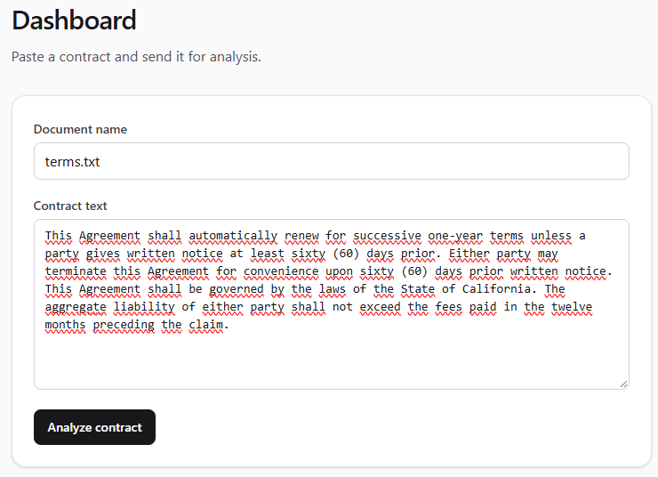
</p>

<p align="center">
  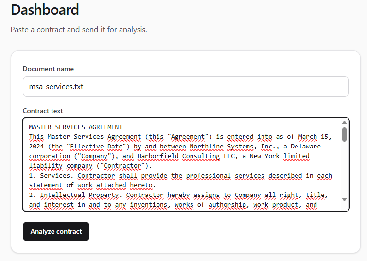
  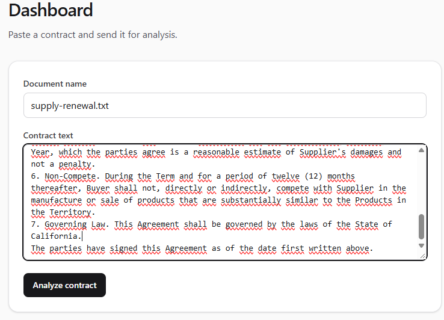
</p>

### Analysis results

Clause cards with risk badges, the extracted span, confidence, and character offsets.

<p align="center">
  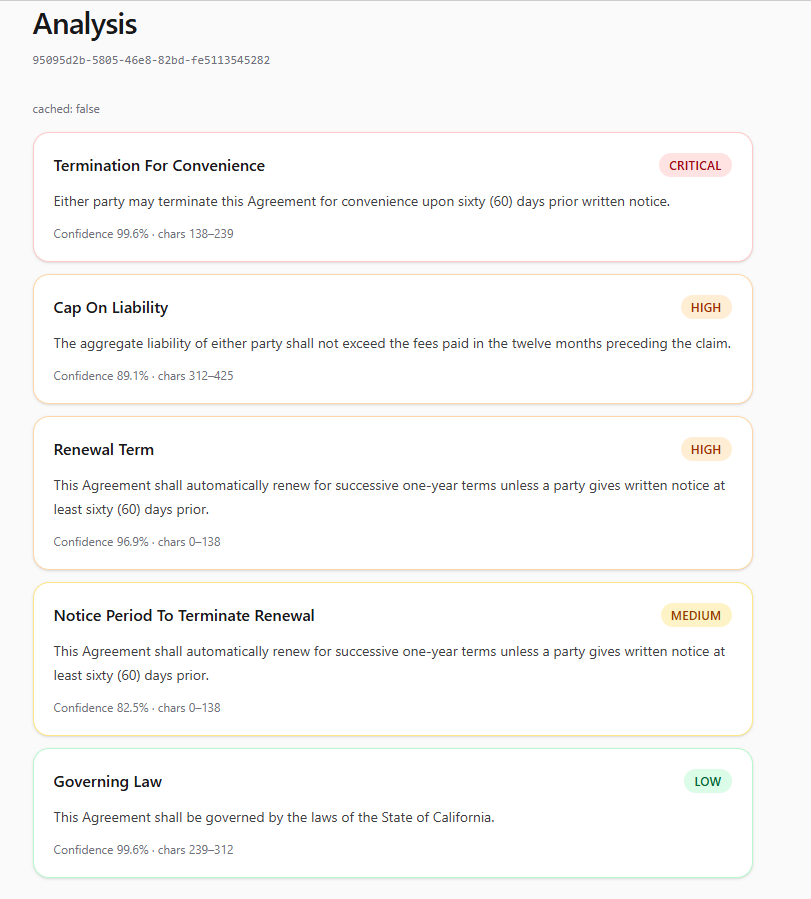
</p>

<p align="center">
  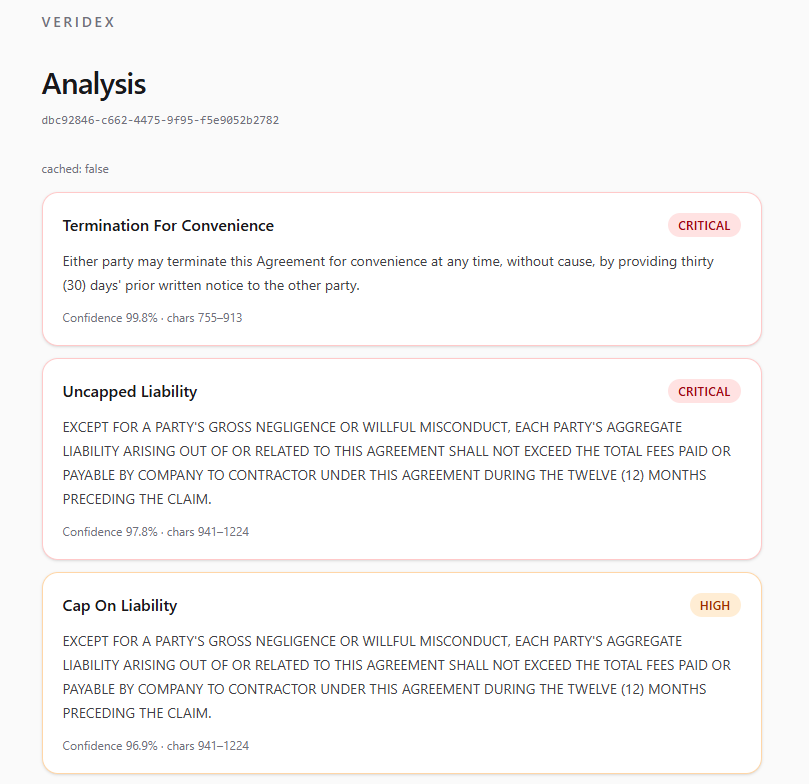
  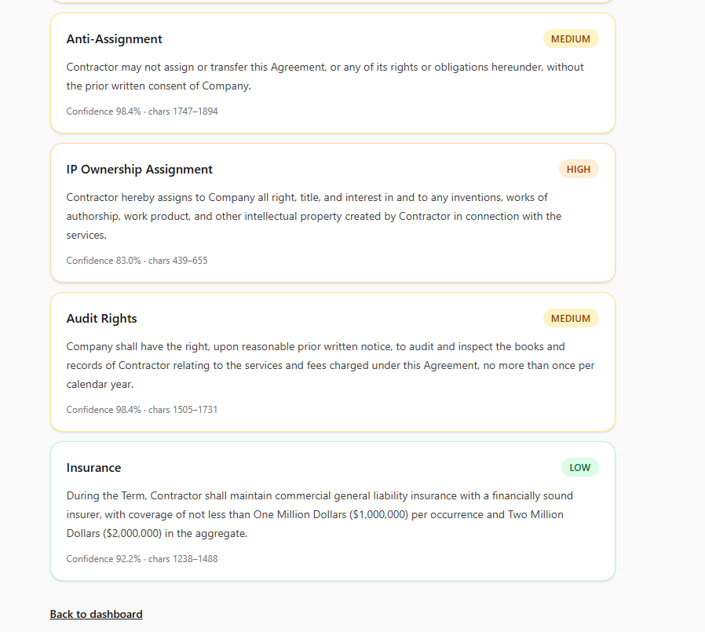
</p>

<p align="center">
  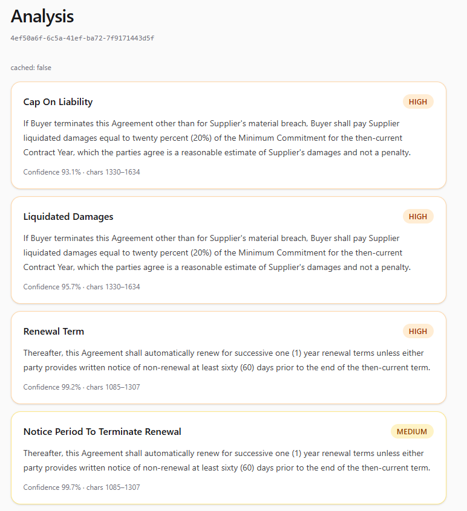
  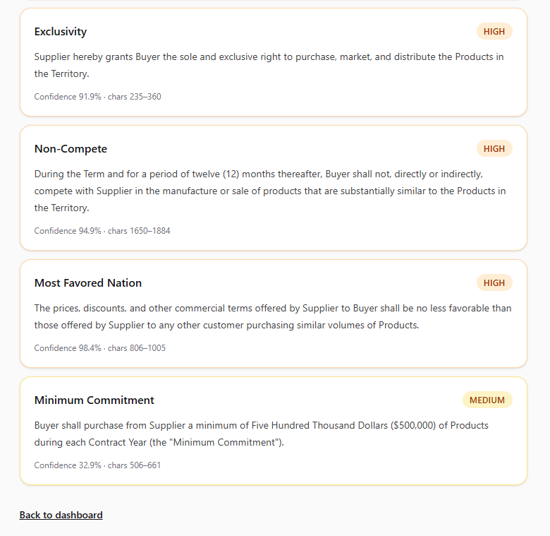
</p>

### History and API keys

<p align="center">
  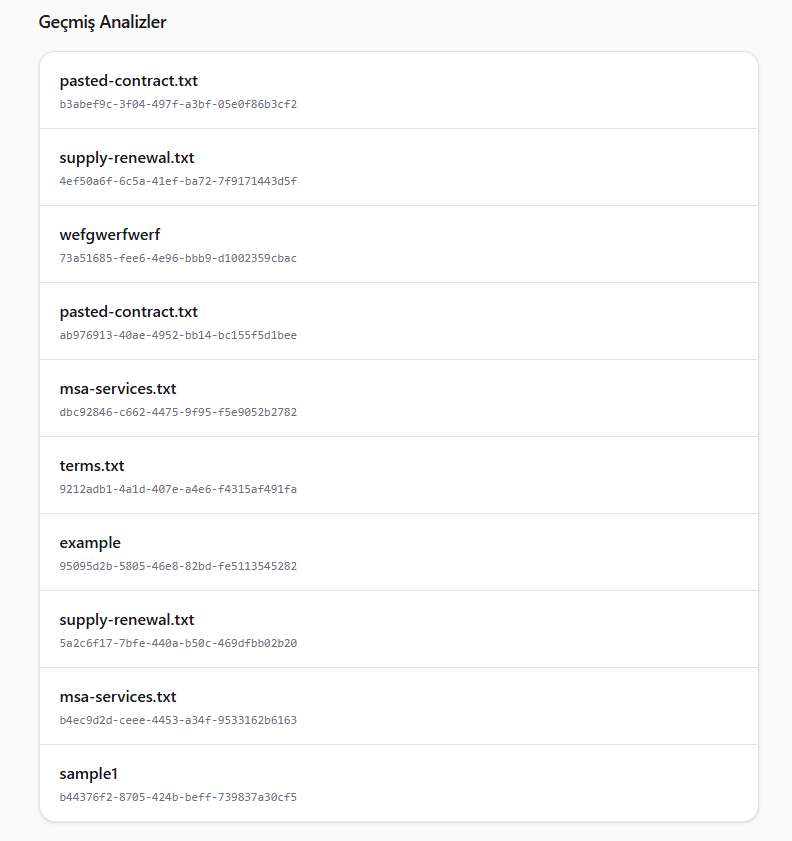
  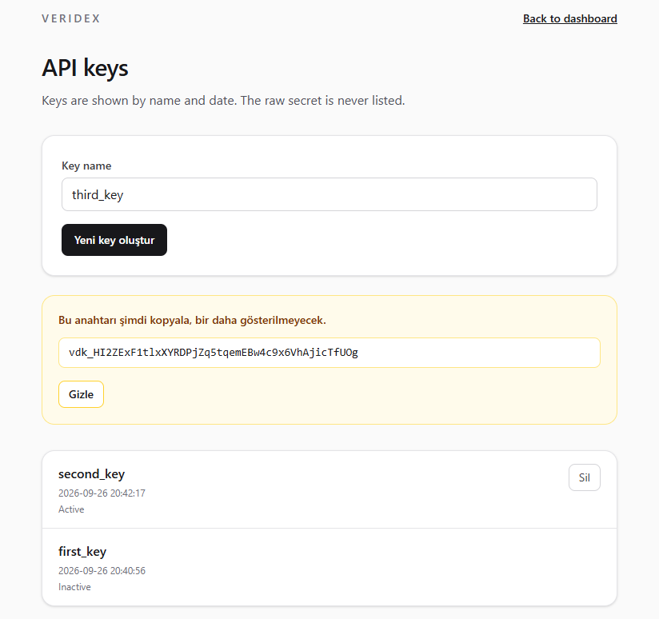
</p>

### Training in MLflow

Full fine-tune of DeBERTa-v3-base. Validation F1 is the checkpoint metric.

<p align="center">
  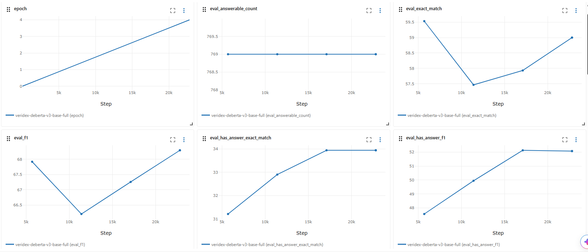
</p>

<p align="center">
  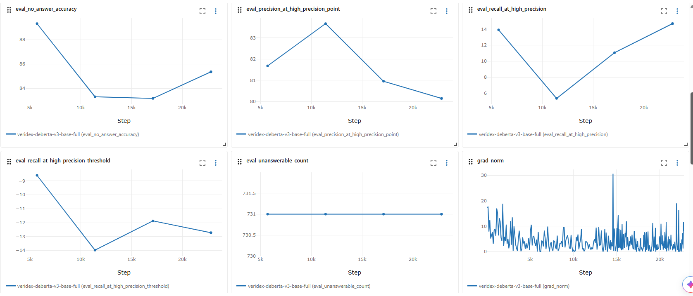
  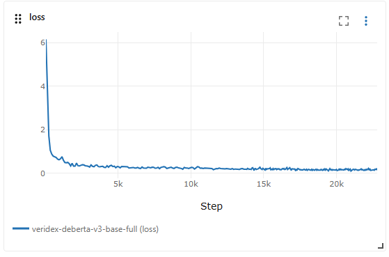
</p>

<p align="center">
  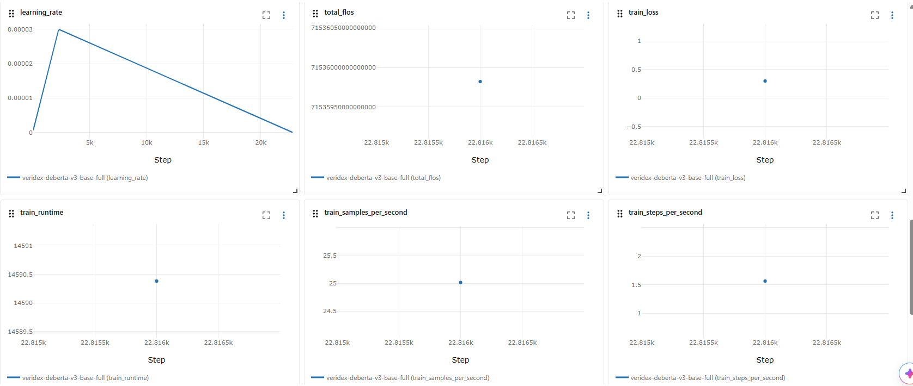
</p>

---

## 🧰 Tech stack

| Layer | Stack |
| --- | --- |
| 🤗 Model | `microsoft/deberta-v3-base` → full fine-tune (no LoRA) on [CUAD](https://www.atticusprojectai.org/cuad) |
| 🔥 Training | PyTorch, Hugging Face Transformers / Datasets / Accelerate, SentencePiece |
| 📊 Tracking | MLflow (`Veridex-QA` registered model, `staging` alias) |
| ⚡ API | FastAPI, Pydantic v2, Uvicorn |
| 🔐 Auth | JWT (PyJWT HS256), refresh tokens, passlib + bcrypt, `vdk_` API keys |
| 🐘 Data | PostgreSQL 16, SQLAlchemy 2, Alembic |
| 🟥 Cache | Redis 7 (async), SHA-256 document key, 24h TTL |
| 🐰 Jobs | Celery + RabbitMQ, one worker, model loaded in the worker only |
| 🖤 App | Next.js 16 App Router, React 19, TypeScript, Tailwind CSS 4 |
| 🐳 Run | Docker Compose (Postgres, Redis, RabbitMQ, API, worker). Frontend stays on `npm run dev` |

---

## 🏗 Architecture

### System

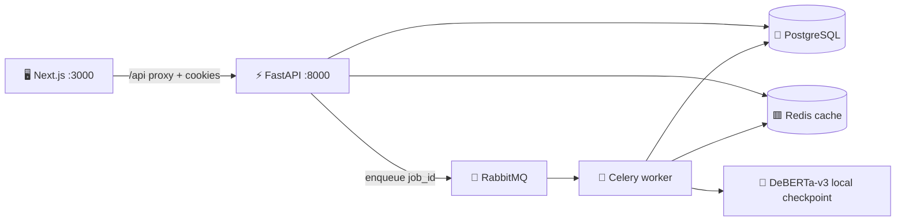

The API never loads the transformer. It authenticates, writes a pending `AnalysisResult`, checks Redis, and publishes a Celery task. The worker bind-mounts `outputs/veridex-qa/best-model` at `/models/best-model` and runs inference on CPU in Compose (`VERIDEX_INFERENCE_DEVICE=cpu`).

### Inference pipeline

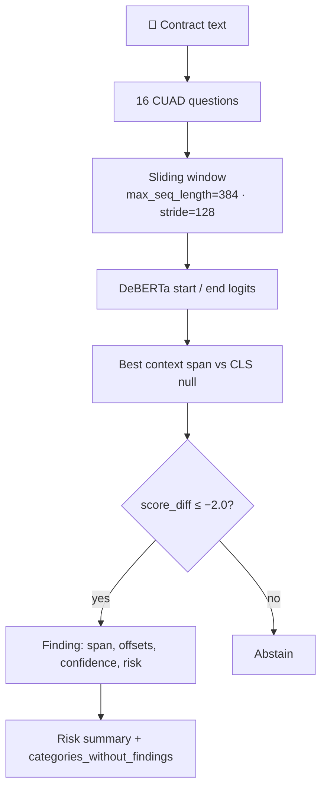

`score_diff = min_null_logit − best_span_logit`. More negative means the model is more sure the clause is present. The live threshold is **−2.0** (`VERIDEX_NULL_SCORE_DIFF_THRESHOLD`).

### Request path

```
Browser
  → Next.js Server Action / /api/[...path] proxy
  → httpOnly cookie forwarded as Authorization: Bearer
  → FastAPI
       POST /analyze  → 202 { job_id, status, cached }
       GET  /analyze/{job_id}  → pending | processing | completed | failed
  → Worker scores the catalog
  → UI polls every 3s and renders clause cards
```

Auth for analyze is dual-mode: **JWT Bearer** (web) or **`X-API-Key: vdk_…`** (scripts). History in the browser is namespaced by JWT `sub` so two accounts on one machine do not share jobs.

---

## 🤗 Model and scores

**Checkpoint:** [Bartu0nder/Veridex-QA-cuad-deberta-v3](https://huggingface.co/Bartu0nder/Veridex-QA-cuad-deberta-v3)

| | |
| --- | --- |
| Base | `microsoft/deberta-v3-base` (183.8M) |
| Data | [CUAD](https://www.atticusprojectai.org/cuad) (`theatticusproject/cuad-qa`) — 510 contracts, 41 clause types, lawyer-annotated |
| Method | Full fine-tuning, 4 epochs, AdamW, lr `3e-5`, batch 16, warmup 0.1, weight decay 0.01 |
| Window | `max_seq_length=384`, `doc_stride=128`, `n_best_size=20`, `max_answer_length=256` |
| Negatives | All answer-bearing windows + 4 sampled empty windows per question |
| Registry | MLflow `Veridex-QA@staging` |

Compose inference uses the **local** `best-model` directory, not a Hub download at request time.

### Held-out test (102 contracts, 4,182 questions)

| Split | Threshold | F1 | Exact match | Has-answer F1 | No-answer acc | Recall @ 80% P |
| --- | ---: | ---: | ---: | ---: | ---: | ---: |
| Validation | trainer `eval_f1` | 68.30 | 59.00 | — | — | — |
| Test | **−2.0 (API default)** | **87.96** | **84.91** | 83.01 | 90.06 | 59.24 |
| Test | −5.0 | 89.03 | 86.49 | 78.15 | 93.64 | 59.24 |

−2.0 keeps more real clauses (has-answer F1 up) and accepts more false positives on absent categories. −5.0 is stricter abstention and a slightly higher aggregate F1.

SQuAD v2 scoring: answerable items have multiple accepted golds, and ~70% of test questions are unanswerable. These numbers are not the original CUAD paper’s PR-AUC.

---

## 📁 Repository layout

```
api/                 FastAPI app, auth, catalog, cache, Celery worker
alembic/             Postgres schema migrations
frontend/            Next.js 16 App Router UI (not in Compose)
training/            Fine-tune, SQuAD-v2 postprocess, evaluate, MLflow registry
scripts/             Hub model card and upload
screenshots/         Product and training captures used in this README
docker-compose.yml   Postgres, Redis, RabbitMQ, API, worker
training/config.yaml Hyperparameters and threshold
outputs/veridex-qa/  Local best-model (gitignored weights)
```

---

## 🚀 Quick start

You need Docker Desktop, Node.js 20+, and the fine-tuned weights at `outputs/veridex-qa/best-model` (train them, or pull the Hub repo).

### 1. Model weights

```bash
huggingface-cli download Bartu0nder/Veridex-QA-cuad-deberta-v3 --local-dir outputs/veridex-qa/best-model
```

### 2. Backend stack

```bash
docker compose up -d --build
```

Compose brings up Postgres 16, Redis 7, RabbitMQ 3.13, the API on **:8000**, and one Celery worker. The API container runs `alembic upgrade head` on boot. Health:

```bash
curl http://127.0.0.1:8000/health
```

Expect `status: ok`, `null_score_diff_threshold: -2.0`, `model_source: local`. The API process itself reports `model_status: not_loaded` — that is correct; the worker holds the weights.

### 3. Frontend

The UI is **not** in Compose.

```bash
cd frontend
copy .env.local.example .env.local
npm install
npm run dev
```

Open [http://localhost:3000](http://localhost:3000). Next proxies `/api/*` to `http://localhost:8000` and forwards the session cookie as Bearer.

### 4. Click through

1. Create an account → you land on `/dashboard`.
2. Paste a contract → Analyze → you are sent to `/analysis/{job_id}`.
3. Cards appear when the worker finishes (a few seconds on CPU).
4. `/settings/api-keys` issues a `vdk_…` key shown once.

### Local API without Docker

```bash
python -m venv .venv
.venv\Scripts\activate
pip install -r requirements.txt
```

Copy `.env.example`, point `DATABASE_URL` / `REDIS_URL` / `RABBITMQ_URL` at running services, then:

```bash
python -m alembic upgrade head
python -m uvicorn api.main:app --host 127.0.0.1 --port 8000
python -m celery -A api.workers.celery_app worker --loglevel=info --concurrency=1
```

`VERIDEX_MODEL_SOURCE` is `registry`, `local`, or `mock`. Compose uses `local`.

```env
VERIDEX_MODEL_SOURCE=local
VERIDEX_LOCAL_MODEL_PATH=outputs/veridex-qa/best-model
VERIDEX_NULL_SCORE_DIFF_THRESHOLD=-2.0
VERIDEX_INFERENCE_DEVICE=auto
VERIDEX_INFERENCE_BATCH_SIZE=16
VERIDEX_MAX_DOCUMENT_CHARACTERS=500000
```

Interactive docs: [http://127.0.0.1:8000/docs](http://127.0.0.1:8000/docs)

---

## 📡 API

Analyze endpoints accept **either** `Authorization: Bearer <access_jwt>` **or** `X-API-Key: vdk_…`.

| Method | Path | Auth | Status | Purpose |
| --- | --- | --- | ---: | --- |
| `GET` | `/health` | no | 200 | Process health, threshold, model source |
| `GET` | `/clause-categories` | no | 200 | Catalog names, risk levels, CUAD questions |
| `POST` | `/auth/register` | no | 201 | Create user (`email`, password ≥ 8) |
| `POST` | `/auth/login` | no | 200 | `access_token` + `refresh_token` |
| `POST` | `/auth/refresh` | no | 200 | New access token from refresh |
| `POST` | `/auth/api-keys` | JWT | 201 | Create key — raw secret once |
| `GET` | `/auth/api-keys` | JWT | 200 | List keys (hash only, never the secret) |
| `DELETE` | `/auth/api-keys/{key_id}` | JWT | 204 | Deactivate |
| `POST` | `/analyze` | JWT or API key | 202 | Queue job; `cached: true` if Redis hit |
| `GET` | `/analyze/{job_id}` | JWT or API key | 200 | Job status + result payload |

`POST /analyze` body:

```json
{
  "document_name": "supply_agreement.txt",
  "document_text": "This Agreement shall automatically renew...",
  "contract_type": "supply",
  "clause_categories": ["Governing Law", "Cap On Liability"]
}
```

`clause_categories` is optional (full catalog). Names accept `Governing Law` or `governing_law`. `contract_type` is `lease` | `supply` | `nda` | `service` | `employment` | `other`.

Documents over **500,000** characters return **413**.

Accepted job:

```json
{ "job_id": "95095d2b-5805-46e8-82bd-fe5113545282", "status": "pending", "cached": false }
```

Completed payload includes `findings[]` (`category`, `risk_level`, `clause_text`, offsets, `confidence`), `risk_summary`, `categories_without_findings`, `model_source`, and `is_mock_response`.

---

## 🎓 Train and evaluate

```bash
python -m training.train --config training/config.yaml
python -m training.evaluate --model-path outputs/veridex-qa/best-model --split test
python -m training.evaluate --model-path outputs/veridex-qa/best-model --split test --sweep-null-thresholds 0 -1 -2 -5
python -m training.registry --model-path outputs/veridex-qa/best-model
```

```bash
mlflow ui --backend-store-uri sqlite:///mlflow.db --port 5000
```

Questions must stay in the CUAD shape the model learned:

```text
Highlight the parts of this contract related to "Termination For Convenience".
```

---

## 🛡 Security notes

- Passwords are bcrypt. Access tokens are HS256, 30 minutes; refresh tokens last 7 days.
- API keys are `vdk_` + 32 url-safe bytes. Only the SHA-256 digest is stored.
- The raw key is shown once in the UI, then the row is name + date + active/inactive.
- Analyze jobs are scoped to the owning user (`403` on someone else’s `job_id`).
- Set `SECRET_KEY` (min 32 chars) before any non-local deploy. Compose defaults are for development.

---

## 📜 License

Model weights and CUAD annotations follow **[CC BY 4.0](https://creativecommons.org/licenses/by/4.0/)**. Cite [The Atticus Project](https://www.atticusprojectai.org/cuad) when you use the dataset or the published checkpoint.

The application code in this repository is provided as a portfolio demonstration. It is not a law-firm tool and must not be the sole basis for a contractual decision.

---

<p align="center">
  <sub>Built by Bartu Önder · model on <a href="https://huggingface.co/Bartu0nder/Veridex-QA-cuad-deberta-v3">Hugging Face</a></sub>
</p>
